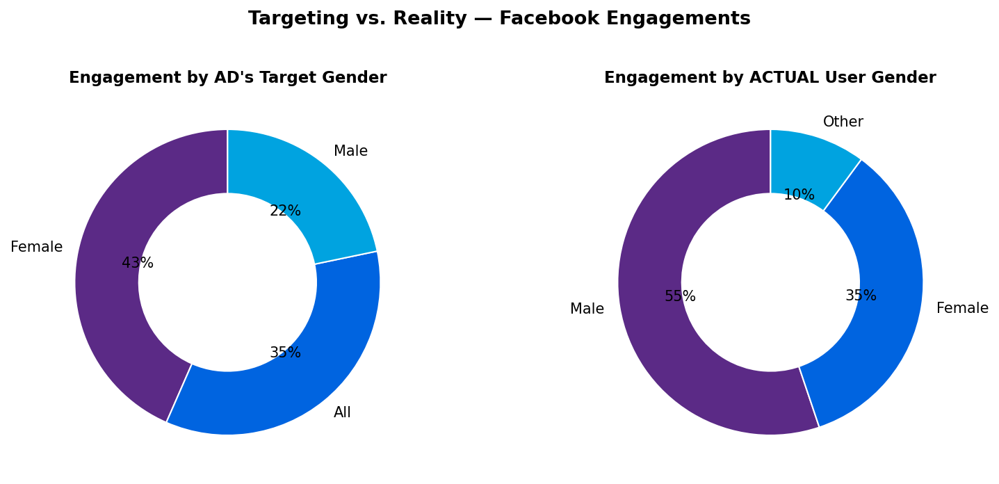
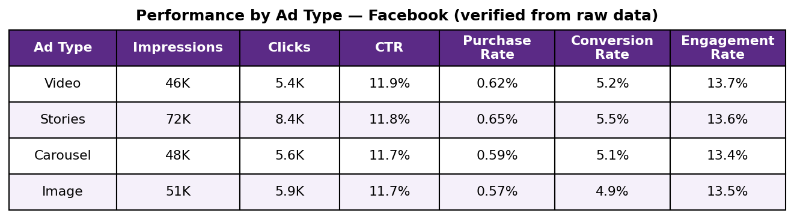
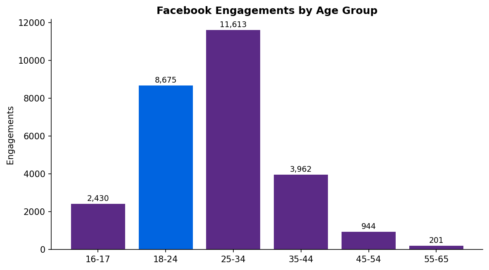
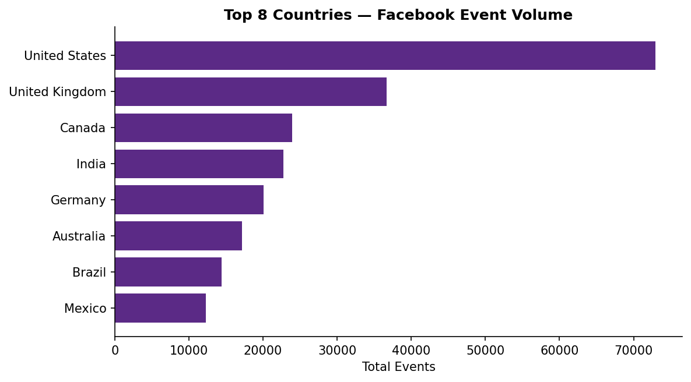
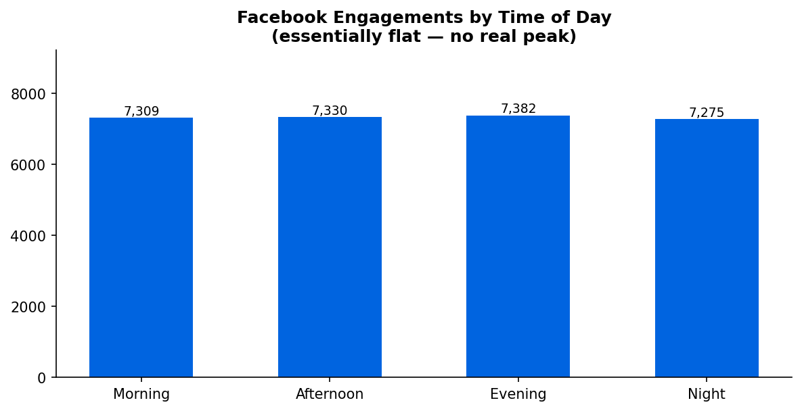

 Meta_Ad_Performance_Analysis - Facebook vs Instagram
==================================================================

*Analyzing 400,000 ad events across 200 ads and 50 campaigns to compare Facebook vs. Instagram performance and audience targeting accuracy, using Power BI + DAX.*

---

###  Table of Contents

- [Overview](#overview)
- [Business Problem](#business-problem)
- [Dataset](#dataset)
- [Tools & Technologies](#tools--technologies)
- [Project Structure](#project-structure)
- [Key Metrics](#key-metrics)
- [Research Questions & Key Findings](#research-questions--key-findings)
- [Dashboard](#dashboard)
- [How to Run This Project](#how-to-run-this-project)
- [Final Recommendations](#final-recommendations)
- [Author & Contact](#author--contact)

---

## Overview

This project tracks Meta (Facebook + Instagram) ad performance end-to-end reach,
engagement, conversions, and budget through a star-schema data model and a
3-page interactive Power BI dashboard, with every KPI computed live via DAX
rather than pre-aggregated in the source data.

## Business Problem

The business needs a performance-tracking report for campaigns running on
Facebook and Instagram, giving the marketing team visibility to:

- Identify the more effective platform (Facebook vs. Instagram)
- Track campaign ROI and optimize budget allocation
- Understand audience engagement patterns
- Check whether ad **targeting** actually matches who **engages** - this turned out to matter a lot, see Key Findings

**Scope:** Facebook and Instagram paid ads only. Messenger, Audience Network, and organic engagement are explicitly out of scope.

## Dataset

A star schema of 4 tables (fact + 3 dimensions):

| Table | Role | Rows | Columns |
|---|---|---|---|
| `ad_events` | Fact - every impression/click/share/comment/purchase | 400,000 | 7 |
| `ads` | Dimension - creative, platform, targeting | 200 | 7 |
| `campaigns` | Dimension - budget, timeframe | 50 | 6 |
| `users` | Dimension - demographics, interests | 9,841 | 7 |

Full field-by-field reference: [`docs/domain_knowledge.md`](docs/domain_knowledge.md)

## Tools & Technologies

- Power BI (3-page dashboard, star schema, DAX measures)
- DAX (19 measures - dynamic-metric pattern via a disconnected parameter table)
- Python (pandas + [pbixray](https://github.com/Hugoberry/pbixray)) - used to recover and verify the data, not required to use the dashboard itself

## Project Structure

```
meta-ad-performance-analysis-powerbi/
│
├── README.md
├── .gitignore
├── requirements.txt
│
├── data/                            # Recovered from the .pbix - see note below
│   ├── ad_events.csv                # 400,000 rows - fact table
│   ├── ads.csv                      # 200 rows
│   ├── campaigns.csv                # 50 rows
│   └── users.csv                    # 9,841 rows
│
├── dashboard/                       # Power BI dashboard file
│   └── Meta_Ad_Performance_Dashboard.pbix
│
├── images/                          # Original charts generated from the recovered data
│   ├── gender_targeting_vs_actual.png
│   ├── ad_type_performance_table.png
│   ├── age_group_engagement.png
│   ├── top_countries.png
│   └── time_of_day.png
│
├── docs/                            # Source documentation, reorganized
│   ├── domain_knowledge.md          # Star schema + field-by-field reference
│   └── business_requirements.md     # BRD - objective, scope, KPI formulas, chart spec
│
├── scripts/
│   └── dax_measures.dax             # All 19 DAX measures, extracted verbatim from the .pbix
│
└── logs/
    └── data_processing_log.md       # How data/ was recovered + every finding below, verified
```


## Key Metrics

Every number below was computed independently from the recovered data and
cross-checked against the dashboard's own DAX measures - both agree exactly.

| Metric | Facebook | Instagram |
|---|---|---|
| Impressions | 215,972 | 123,840 |
| Clicks | 25,389 | 14,690 |
| Shares | 1,275 | 682 |
| Comments | 2,632 | 1,476 |
| Purchases | 1,323 | 708 |
| Engagements (Clicks+Shares+Comments) | 29,296 | 16,848 |
| CTR | 11.76% | 11.86% |
| Engagement Rate | 13.56% | 13.60% |
| Conversion Rate | 5.21% | 4.82% |
| Purchase Rate | 0.61% | 0.57% |

- **Total Budget** (all 50 campaigns, both platforms): $2,535,923.78
- **Avg. Budget per Campaign**: $50,718.48

Facebook carries roughly double Instagram's volume in every raw count, but the
*rate* metrics are close - Instagram edges out Facebook on CTR and Engagement
Rate, while Facebook converts clicks to purchases somewhat better (5.21% vs. 4.82%).

## Research Questions & Key Findings

| Research Question | Key Finding |
|---|---|
| Which platform performs better? | Close on efficiency (rates within ~1pt of each other); Facebook has 2* the volume and a better Conversion Rate (5.21% vs 4.82%) |
| Does ad **targeting** match who **actually** engages? | **No - and by a lot.** Facebook ads are targeted at women most often (43% Female vs. 22% Male engagement *by target*), but the people who actually engage skew male (55% Male vs. 35% Female *by real user*). See `images/gender_targeting_vs_actual.png` |
| Which ad format performs best? | Stories has the highest volume (72K impressions) and Purchase Rate (0.65%); Video has the highest CTR (11.9%) and Engagement Rate (13.7%). Carousel and Image trail on every metric |
| Which age group engages most? | 25-34 by a clear margin (11,613 engagements), with 18-24 second (8,675) - engagement drops off sharply after 35 |
| Which countries drive the most volume? | US, UK, Canada, India, Germany - **not** the "US, India, Brazil, Germany, UK" ranking in the original insights doc; see `images/top_countries.png` |
| Does engagement really peak in the evening? | **No.** Facebook engagement is essentially flat across Morning/Afternoon/Evening/Night (7,275-7,382, ~1.5% spread) - a claimed evening peak doesn't hold up against the raw counts |
| Is there a real weekly pattern? | No - also flat (4,128-4,274 across all 7 days, ~3.4% spread), which does match what the original insights doc claimed |
| Is `Like` counted as engagement? | It exists in the data (12,013 events, 3% of all events) but isn't in the `Engagements` DAX measure or the original documentation - a real gap, not a rounding issue |

Full detail and the verification methodology behind every row above:
[`logs/data_processing_log.md`](logs/data_processing_log.md)

## Dashboard

Power BI dashboard - **3 pages** (from `dashboard/Meta_Ad_Performance_Dashboard.pbix`):

- **Facebook** - full KPI/chart set (~20 visuals) filtered to Facebook: 2 KPI-card rows, a dynamic-metric donut by target gender, a bar chart by age group, a map by country, a weekly trend column chart, an hourly trend area chart, and an ad-type breakdown table
- **Instagram** - identical layout, filtered to Instagram, for direct side-by-side comparison
- **Calendar Tool Tip** - a hover tooltip page (not a standalone page you navigate to)

Every chart's metric (Impressions/Engagements/Clicks/Shares/Comments/Purchases)
switches dynamically via a single slicer, powered by a disconnected parameter
table - see `scripts/dax_measures.dax` for exactly how.











## How to Run This Project

**1. Clone the repository:**
```bash
git clone https://github.com/yourusername/meta-ad-performance-analysis-powerbi.git
```

**2. Open the dashboard directly** - the `.pbix` has the full dataset embedded, so it opens and works standalone:
```
dashboard/Meta_Ad_Performance_Dashboard.pbix
```

**3. (Optional) Re-verify or regenerate the charts yourself:**
```bash
pip install -r requirements.txt
```
`data/*.csv` is already the recovered, ready-to-use data - you don't need to
re-extract it from the `.pbix` unless you want to confirm the process in
`logs/data_processing_log.md` yourself.

## Final Recommendations

- **Fix the targeting mismatch first** - ads skew toward targeting women, but men drive most engagement; either re-target based on who actually responds, or treat the female-targeted ads as reaching a genuinely different (and currently under-measured) male audience
- **Shift budget toward Stories and Video** - both outperform Carousel and Image on every metric in the table above
- **Don't schedule around a time-of-day peak that isn't there** - the "evening peak" in the original insights doc doesn't hold up; delivery timing isn't a lever worth optimizing on this data
- **Decide what to do with `Like` events** - either fold them into `Engagements` for a more complete picture, or document explicitly why they're excluded
- **Prioritize the top 5 countries (US, UK, Canada, India, Germany)** for budget concentration, replacing Brazil in the original targeting list with Canada

## Author & Contact

 - Mohammad Somama
 - Data Analyst
- **Email:** [mohammadsomama01@gmail.com](mailto:mohammadsomama01@gmail.com)
- **LinkedIn:** [LinkedIn Profile](https://www.linkedin.com/in/mohammad-somama-67a825315/)
- **GitHub:** [Mohammad Somama](https://github.com/mohammad-somama)


